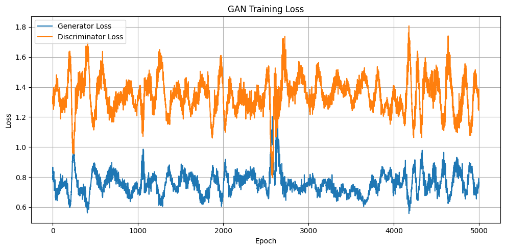
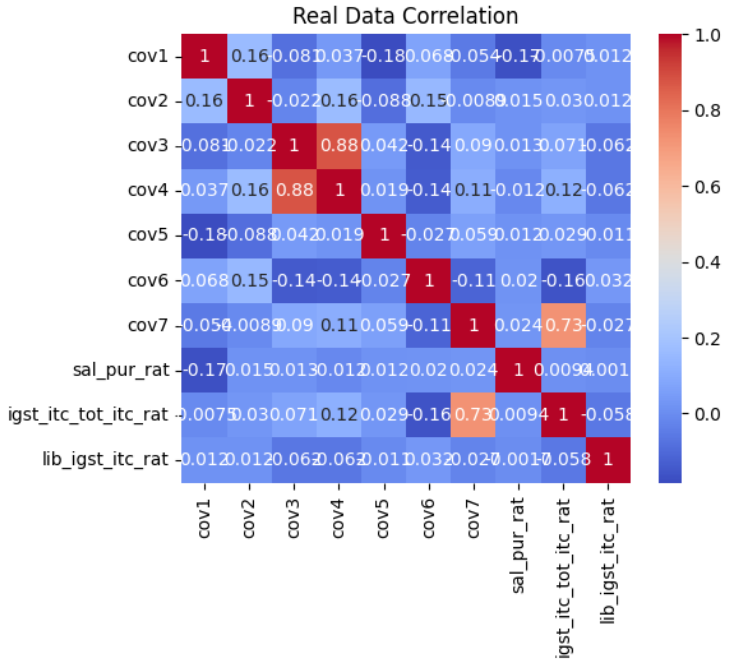
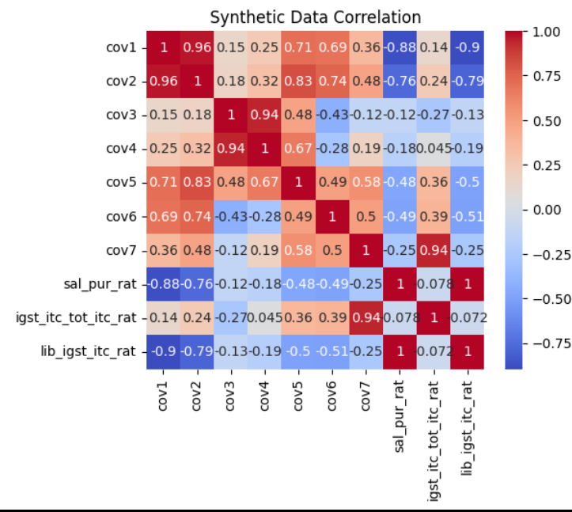

# GAN-Based Synthetic Data Generation

> **Course:** SM24 M.Tech – Advanced Machine Learning  
 
> - **Prince Verma** – SM24MTECH11003  


---

## 📌 Objective

This project aims to generate **synthetic tabular data** using a **Generative Adversarial Network (GAN)** and evaluate how closely it mimics the **real dataset**. The comparison is done via **feature-wise distribution plots** and **pairwise Pearson correlation heatmaps**.

---

## 📂 Dataset Description

- The dataset is loaded from an Excel file named `data.xlsx`.
- Only **numerical columns** are used for GAN training.
- Data is **normalized** using Min-Max Scaling for efficient GAN training.
- Synthetic data is saved as `synthetic_data.csv`.

---

## ⚙️ Methodology

### 1. 🧠 GAN Architecture

#### Generator
- Input: Random noise vector (latent space)
- Output: Synthetic data vector with same feature dimensions as real data

#### Discriminator
- Input: A data vector (real or synthetic)
- Output: Probability indicating if the input is real

> The Generator learns to **fool** the Discriminator, while the Discriminator learns to **detect fakes**. They improve together in a zero-sum game.

---

## 🔁 Training Process

- Total epochs: `5000`  
- Batch size: `64`  
- Loss: Binary Cross-Entropy  
- Optimizer: Adam (`lr = 0.0002`)  
- Generator and Discriminator losses are tracked and plotted over epochs.

### 🔻 Loss Curve


---

## 📊 Evaluation Metrics

### 1. Feature Distribution Comparison

- For each feature, KDE plots show the distribution of:
  - Real data (Blue)
  - Synthetic data (Orange)
- This shows how well the synthetic data mimics each real feature.

### 2. Pearson Correlation Heatmaps

- Correlation matrices are computed for:
  - Real dataset
  - Synthetic dataset
- Heatmaps show inter-feature relationships and structural similarity.

---

## 🖼️ Visual Outputs

### ✅ KDE Distribution Example


### ✅ Correlation Matrix Example

| Real Data | Synthetic Data |
|-----------|----------------|
|  |  |

---

## 💾 Files in Repository

| File | Description |
|------|-------------|
| `data.xlsx` | Input Excel file with real tabular data |
| `gan_synthetic_data.py` | Python script for GAN training, generation, and evaluation |
| `synthetic_data.csv` | Output synthetic dataset |
| `gan_loss_plot.png` | Plot of Generator & Discriminator loss curves |
| `README.md` | Project documentation |

---

## 🚀 How to Run

### 1. 📦 Install Dependencies

```bash
pip install pandas numpy matplotlib seaborn scikit-learn torch openpyxl
